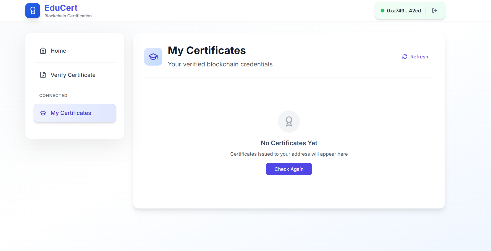
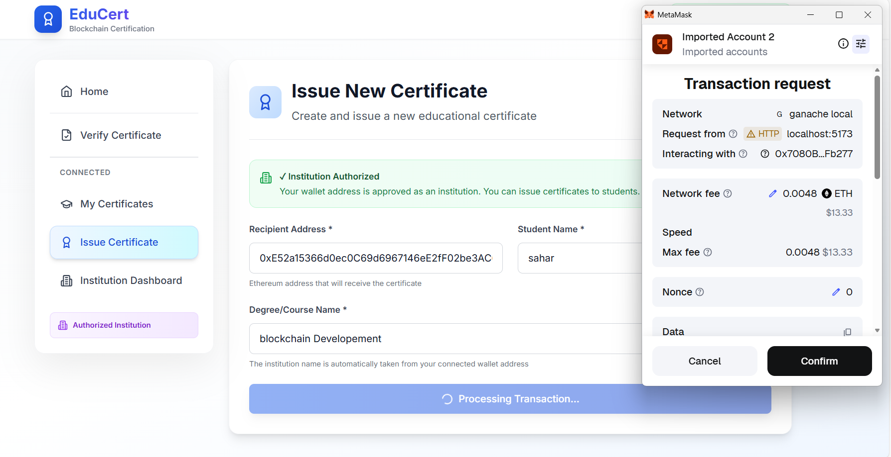
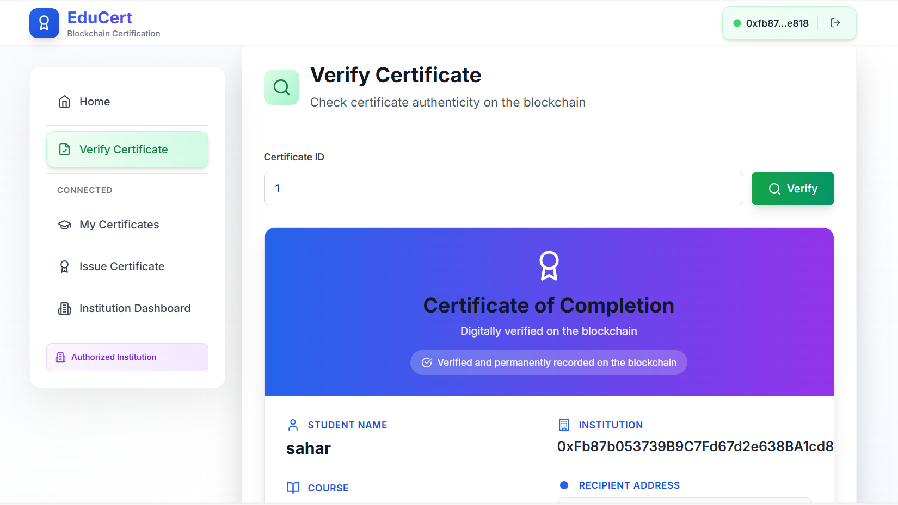
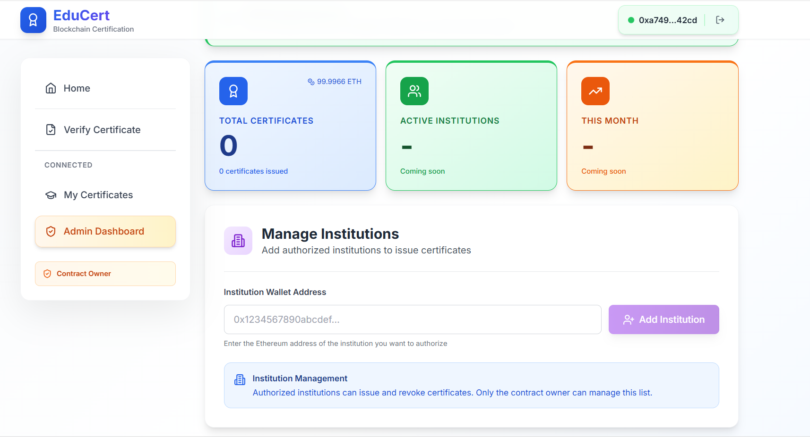
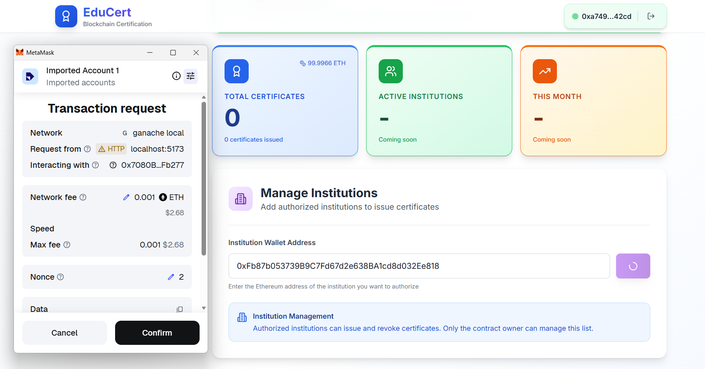
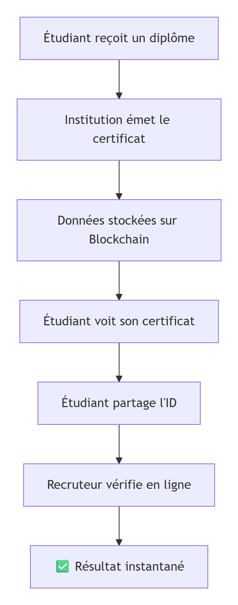

Voici un **README complet et bien structuré** pour ton projet EduCert, basé sur les informations que tu as fournies :

---

# EduCertificate - Plateforme de Certification Blockchain


Un système décentralisé pour émettre et vérifier des certificats éducatifs

[](https://reactjs.org)
[](https://nodejs.org)
[](https://www.mongodb.com/)
[](https://soliditylang.org/)
[](https://metamask.io/)

Projet académique full stack : Frontend + Backend + Blockchain

</div>

---

## 🎯 Description

EduCert est une application décentralisée qui permet aux institutions d'émettre des certificats sur la blockchain, aux étudiants de les stocker dans leur portefeuille numérique, et aux recruteurs de les vérifier instantanément.

**Problème résolu :** éliminer les faux diplômes grâce à la transparence et à l’immutabilité de la blockchain.

---

## 🛠️ Stack Technique

### Frontend

| Technologie  | Version | Lien                                                  | Rôle                 |
| ------------ | ------- | ----------------------------------------------------- | -------------------- |
| React        | 18.2    | [reactjs.org](https://reactjs.org)                    | Interface web        |
| TypeScript   | 5.0     | [typescriptlang.org](https://www.typescriptlang.org/) | Typage statique      |
| Vite         | 4.0     | [vitejs.dev](https://vitejs.dev/)                     | Build tool rapide    |
| Tailwind CSS | 3.3     | [tailwindcss.com](https://tailwindcss.com/)           | Styling              |
| Ethers.js    | 6.0     | [docs.ethers.org](https://docs.ethers.org/)           | Connexion blockchain |

### Backend

| Technologie | Version | Lien                                                  | Rôle               |
| ----------- | ------- | ----------------------------------------------------- | ------------------ |
| Node.js     | 18.x    | [nodejs.org](https://nodejs.org/)                     | Runtime JavaScript |
| Express     | 4.18    | [expressjs.com](https://expressjs.com/)               | Framework web      |
| TypeScript  | 5.0     | [typescriptlang.org](https://www.typescriptlang.org/) | Typage statique    |
| MongoDB     | 6.0     | [mongodb.com](https://www.mongodb.com/)               | Base de données    |
| Mongoose    | 7.0     | [mongoosejs.com](https://mongoosejs.com/)             | ORM MongoDB        |
| JWT         | 9.0     | [jwt.io](https://jwt.io/)                             | Authentification   |

### Blockchain

| Technologie | Version | Lien                                                          | Rôle                    |
| ----------- | ------- | ------------------------------------------------------------- | ----------------------- |
| Solidity    | 0.8.18  | [soliditylang.org](https://soliditylang.org/)                 | Langage smart contracts |
| Ganache     | 7.0     | [trufflesuite.com/ganache](https://trufflesuite.com/ganache/) | Blockchain locale       |
| Remix IDE   | -       | [remix.ethereum.org](https://remix.ethereum.org/)             | Développement en ligne  |
| MetaMask    | 11.x    | [metamask.io](https://metamask.io/)                           | Portefeuille crypto     |

---

## 📥 Installation des outils

### 1. MetaMask

* [Lien](https://metamask.io/download)
* Installez l’extension, créez un portefeuille et notez votre phrase de récupération.

### 2. Ganache

* [Lien](https://trufflesuite.com/ganache/)
* Téléchargez et lancez Ganache pour obtenir 10 comptes test avec 100 ETH chacun.

### 3. Remix IDE

* [Lien](https://remix.ethereum.org)
* Éditez, compilez et déployez vos smart contracts directement depuis le navigateur.

### 4. MongoDB

* [Lien](https://www.mongodb.com/try/download/community)

### 5. Node.js

* [Lien](https://nodejs.org)
* Installer Node.js v18+ et vérifier :


## ✨ Fonctionnalités

### Pour les Étudiants

* Voir tous ses certificats dans un portfolio
* Partager facilement via un ID unique
* Télécharger une preuve numérique
* Vérifier l'authenticité de ses diplômes

### Pour les Institutions

* Émettre des certificats en quelques clics
* Gérer les diplômes avec un dashboard
* Révoquer un certificat si nécessaire
* Suivre les statistiques d'émission

### Pour les Recruteurs

* Vérifier instantanément un diplôme
* Pas besoin de compte, accès public via ID
* Confiance totale grâce à la blockchain
* Interface simple et intuitive

### Pour les Admins

* Gérer les institutions autorisées
* Voir toutes les statistiques
* Surveiller l'activité du réseau
* Configurer les paramètres du système


## 🖼️ Captures d’écran

🏠 **Page d’accueil**


📜 **Mes Certificats**


🎓 **Émettre un Certificat**


🔍 **Vérification**


 **Page d’admin**


  **AddInstitution**
 


## 🔄 Architecture & Flux Technique
 **Pipeline Complet** 


  **Flux Technique** 
```
┌─────────────┐     ┌─────────────┐     ┌─────────────┐
│  FRONTEND   │────▶│   BACKEND   │────▶│   MONGODB   │
│   React     │     │   Node.js   │     │   Database  │
│ Interface   │◀────│     API     │◀────│ Users/Logs  │
└──────┬──────┘     └──────┬──────┘     └─────────────┘
       │                   │
       ▼                   ▼
┌─────────────┐     ┌─────────────┐
│  METAMASK   │────▶│   GANACHE   │
│  Wallet     │     │ Blockchain  │
│  Signer     │◀────│   Local     │
└─────────────┘     └─────────────┘
```

**Étape 1 : Émission d'un Certificat**


**Étape 2 : Vérification d'un Certificat**


**Étape 3 : Gestion par l'Étudiant**


## 🚀 Installation rapide

```bash
# Cloner le projet
git clone https://github.com/votre-username/educert.git
cd educert

# Installer les dépendances Frontend
cd frontend
npm install

# Installer les dépendances Backend
cd ../backend
npm install

# Configurer l'environnement
cp .env.example .env
# Éditez .env avec vos paramètres

# Démarrer MongoDB
docker run -d -p 27017:27017 mongo

# Démarrer Ganache
ganache --port 8545

# Démarrer le Backend
cd backend
npm run dev

# Démarrer le Frontend
cd frontend
npm run dev
```

---
